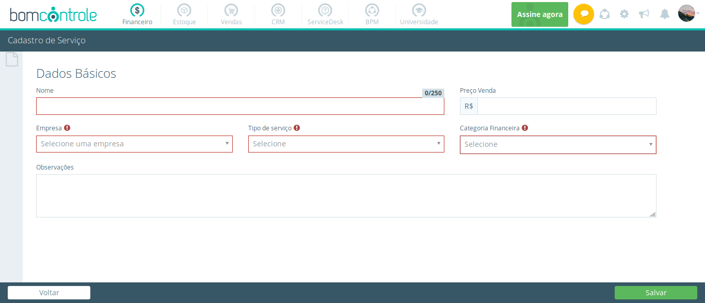

### TotalProd
<!--  -->

Esta é a função Cadastro

<!--topicos  -->
1. [Financeiro](doc/segmentos/financeiro.md)
    1. Dia a Dia
        1. Dashboard
        1. Movimentação
        1. Faturamento
        1. Inadiplência
        1. Conciliação  
        1. Contratos
        1. Aprovação Financeira
        1. Envio de Remessa
        1. Retorno de Remessa
        1. Histórico de Movimentação
        1. Previsão Orçamentária
    1. Cadastros
        1. Serviço
        1. Tipo de Serviço
        1. Minhas Empresas
        1. Fornecedor
        1. Cliente
        1. Categoria Financeira
        1. Contas Bancárias
        1. Departamento
        1. Funcionário
        1. Ramo de Atividade
    1. Visões
        1. Fluxo de Caixa
        1. DRE
        1. Relatório
        1. Relatório Avançado
1. [Estoque](doc/segmentos/Estoque.md)    
    1. Dia a Dia
        1. Dashboard
        1. Entrada de Produto
        1. Saída de Estoque
        1. Ajuste de Estoque
        1. Transferência
        1. Pedidos
        1. Pedido de Compra
        1. Processo de Compra
        1. Consultar Movimentações
        1. Consulta de Estoque
        1. Kardex
        1. Convidar Usuário
    1. Cadastros
        1. Produto  
        1. Estoque Satélite
        1. Minhas Empresas
        1. Departamento
        1. Fornecedor
        1. Classe de Produto
        1. Grupo de Produto
        1. Família de Produto
        1. Unidade de Produto
    1.  Visões
        1. Relatório
        1. Relatório Avançado
1. [Vendas](doc/segmentos/Vendas.md)
    1. Dia a Dia
        1. Dashboard
        1. Orçamento / Venda
        1. Nota Fiscal de Produto
        1. Nota Fiscal de Serviço
    1. Cadastro
        1. Produto
        1. Cliente
        1. Vendedor
        1. Transportadora        
    1. Visões
        1. Relatório
1. [CRM](doc/segmentos/CRM.md)
    1. Dia a Dia             
        1. Dashboard
        1. Oportunidades
        1. Atividades
        1. Conquistas
        1. Perdas
    1. Cadastros
        1. Concorrente
        1. Contato Comercial
        1. Ramo de Atividade
        1. Lead
        1. Motivos
        1. Funil de Vendas
        1. Origem Oportunidade
        1. Vendedor
        1. Proposta
        1. Template de e-mail
    1. Visões  
        1. Relatório
        1. Relatório Avançado
1. [ServiceDesk](doc/segmentos/ServiceDesk.md)
    1. Dia a Dia          
        1. Dashboard
        1. Tickts
        1. Convidar Usuário
    1. Cadastros
        1. Grupo de Suporte
        1. Tipo de Ocorrência
        1. Agentes
        1. Cliente
    1. Visões
        1. Relatório
        1. Relatório Avançado
1. [BPM](doc/segmentos/BPM.md)
    1. Dia a Dia
        1. Dashboard
        1. Processos em Andamento                   
        1. Processos Finalizados
        1. Convidar Usuário
    1. Cadastros
        1. Processo
        1. Papel Organizacional
        1. Departamento
    1. Visões
        1. Relatório
        1. Relatório Avançado     
