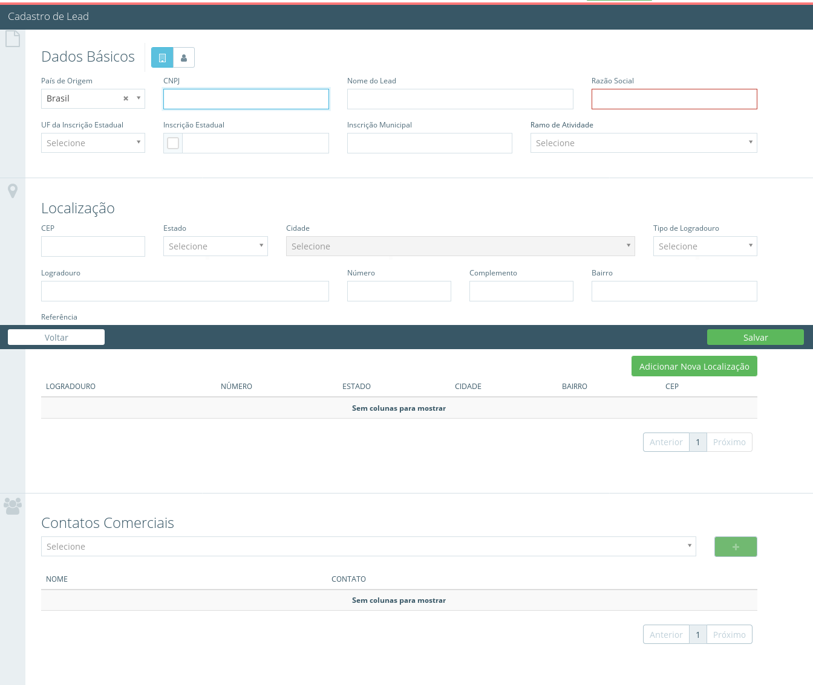

[Voltar ao Inicio](../../)

 ### CRM
 O CRM (Customer Relationship Management), ou Gestão de Relacionamento com o Cliente, é um sistema online que facilita o contato entre os profissionais da sua empresa e os seus clientes.

## Dia    
**Dashboard**

É a apresentação visual das informações mais importantes e necessárias para alcançar um ou mais objetivos do negócio, consolidadas e ajustadas em uma única tela para que a informação possa ser monitorada de forma ágil.

**Oportunidades**

Traga agilidade ao seu fluxo de vendas com a opção de oportunidades do sistema onde é possível criar e gerenciar suas oportunidades de negocio controlando etapa por etapa desde a captação de um novo cliente ate a finalização da venda pode criar diversos processos personalizados para cada tipo de produto ou cliente.  

**Atividades**

Aqui você pode definir atividades para suas oportunidades como definir reuniões, ligações, conferencias online entre outros assim você tem total controle das suas atividades para cada um de seus leds clique em criar ou no ícone de agendamento adicione o tipo de atividades informe os dados e indique um horário para realização desta ação .

**Conquistas**

Aproveite a integração do sistema entre os modulos CRM E FINANCEIRO aqui você tem as visualizações de todas as suas conquistas que já foram aprovada ou ainda estão pendentes de aprovação pelo financeiro.   

**Perdas**

Visualize suas perdas por periodos específicos podendo visualizar seus detalhes como valor, motivo e para qual concorrente você perdeu essa oportunidades.

## Cadastro
**Concorrente**

Aqui te ajuda a identificar seu principais concorrentes ao perder uma venda é possível informar ao sistema qual foi o concorrente que a conquistou assim você poderá realizar relatórios contendo métricas de quais concorrentes mais impacta-o em seus negócios.

**Contato Comercial**

**Ramo de Atividade**

**lead**

**Motivos**

**Funil de Vendas**

**Origem Oportunidade**

**Vendedor**

Aqui no sistema permite a você registrar todos vendedores do seu time para que cada um dele possa criar e gerenciar oportunidades de vendas em CRM assim você pode monitorar o progresso de cada integrante acompanhando seus resultados além de traçar metas mensais para cada integrante da equipe.

**Proposta**

**Template de e-mail**

## Visões    
**Relatório**

### ServiceDesk
**Dashboard**
