[Voltar ao Inicio](../)

### Estoque
É uma área muito importante pois é através dele que será capaz de prever o quanto que será necessário comprar no próximo pedido ao fornecedor.
O controle de estoque de uma empresa grande ou pequena, serve para a empresa avaliar a entrada e saída de mercadorias e auxilia uma companhia a reduzir custos e administrar a cadeia de produção e distribuição com mais eficiência.

## Dia a Dia
**Dashboard**
Aqui você tem a gestão completa de seu estoque é possivel visualizar os pedidos que aguarda liberação produtos vencidados ou em situaçao critica de estoque podemos conferir graficos como movimentação de estoque e tambem checar seus pedido de comprar temos atalhos para dar entrada nas notas fiscais de seus fornecedores realizar entrada dessas mesmas notas de forma automatizada através da importação de seu XML realizar a baixa de estoque e abrir processos de comprar para cotação de produtos no menu estoque é possivel constar suas movimentações realizar tranferencias entre estoque e convidar usuarios para poder realizar pedidos interno tambem podemos cadastra produtos fornecedores,departamento entre outros .  

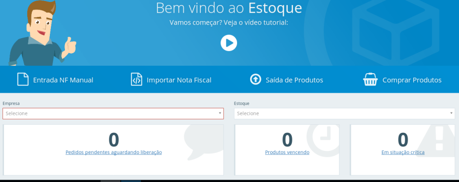

**Entrada de Produto**
Em entrada de produto é possivel dar
entrada de suas notas de serviço manual ou automatica para realizar processo de forma manual insira os dados basicos selecione os produtos informe os valores e seus respectivos impostos e vencimentos é possivel inserir um anexo e um comentario sobre este lançamento podemos apartir desse lançamento criar um rascunho para finalizar o preenchimento posteriormente podemos tambem importar o arquivo XML da nota enviada pelo fornecedor para preenchimento automático de suas notas.

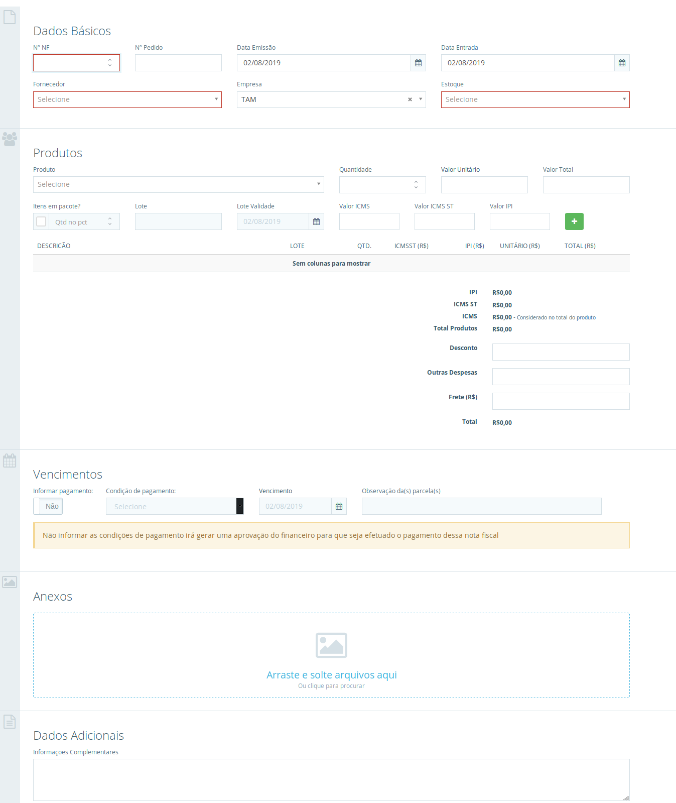

**Saida de Estoque**
Aqui vocẽ podera realizar baixas no estoque apartir de pedidos interno criados para registrar as solicitações de materiais dos departamento de sua empresa assim como realizar baixas manuais de materiais do estoque sem precisar de um pedidos interno para isso primeiramente é exibido total de pedidos interno que estao pendentes de baixa logo abaixo são listados todos os pedidos internos pendentes podemos realizar a baixa manual para baixar diretamente do estoque ou rapidamente selecioná los apartir da opção saída para proceguir com a baixa do material e a seguir são listados os produtos que compõem o pedido interno.

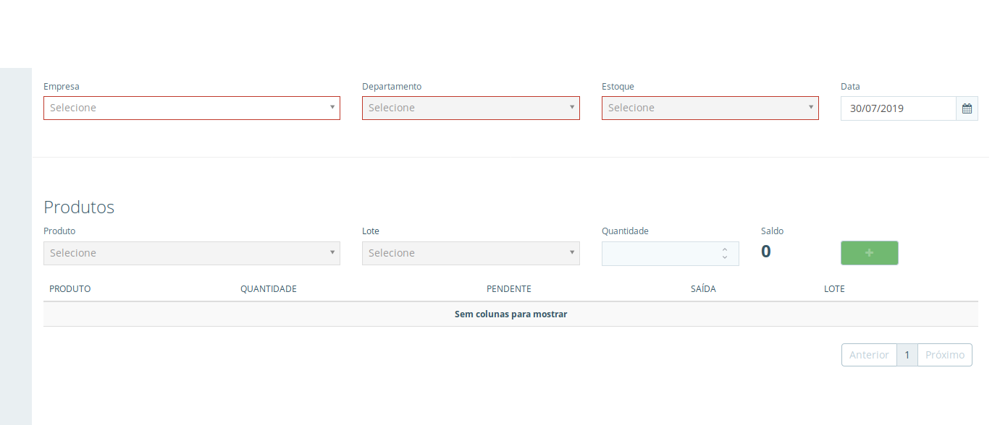

**Ajuste de Estoque**
Em Ajuste de Estoque você podera corrigir o saldos dos produtos de sua empresa de acordo com contagem fisicas realizada nos locais onde estão armazenadas informe a empresa o estoque e os produto caso o produto seja controlado por lote informe se o ajuste será realizado em um lote novo ou em um ja existente insira a quantidade correta do produto informe o preço unitário e uma observação caso necessário, click em salvar é possivel cancelar este ajuste clicando em visualizar e cancelar ajuste.

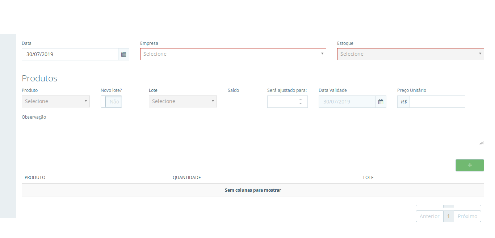

**Transferência de Estoque**
Para empresas com mais de um estoque temos a funcionalidade de Transferência de estoque em tempo real ja é possivel acompanhar o seu saldo atual do iten em relação estoque de origem e criar uma listagem de itens á transferir ao salvar o processo os estoques ja são automaticamente atualizados podendo consultar los caso necessário.

**Pedido Interno**
É possivel incluir solicitações de materiais pasa uso nos setores de sua empresa selecione o departamento e click em começar é possivel alterar a empresa e o departamento insira uma observação indique os produtos e a quantidade que deseja solicitar e click em adicionar apos inserir os produtos click em salvar.

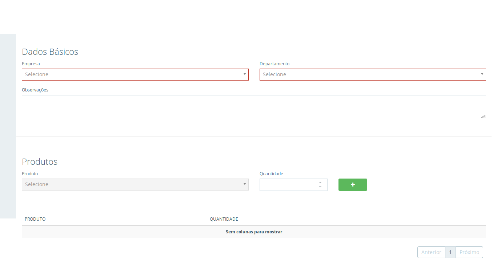

**Pedido de Compra**
Aqui podemos visualizar todos os pedidos realizados podemos realizar filtros para uma rapida localização dos pedidos além de poder tambem criar um novo processo você será redirecionado a página onde é possivel realizar um novo processo de comprar clicando em editar podemos visualizar as informações do pedido e tambem imprimi-lo.

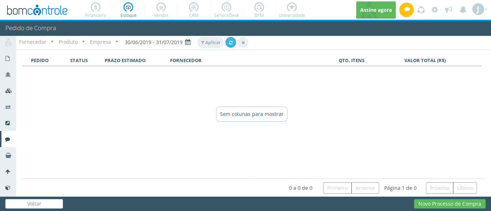

**Processo de Compra**

**Consulta de Movimentação**
Aqui você podera consultar todas as movimentações de estoque ocorrida na sua empresa vamos começar exibindo as movimentações selecione um periodo que haja movimentações é possivel tambem realizar filtros para visualizar movimentações especificas ao localizar as movimentações podemos exportar os dados da pesquisa.

**Consulta de Estoque**

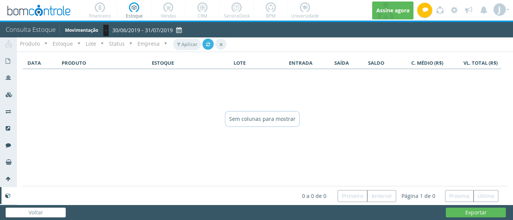

**Kardex**

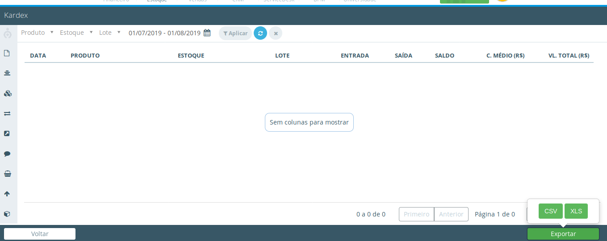

**Convidar Usuários**
Aqui você convida Usuários para ter acesso ao BPM integrado os departamentos e aumentando a produtividade da sua empresa,com esta função você permite que outras pessoas possão abrir gerenciar e aprovar processos através da intranet seja desktop ou seu smartphone.

## Cadastros
**Produto**
Aqui você cadastra todos os produtos que irão compor o seu estoque definindo as categorias para facilitar á sua localização edite as configurações do produto você pode definir se o produto aceita ou não entrada sem a necessidade de um pedido de compra e tambem definir ou limites para que o sistema avise quando um produto chegar a um limite critico para que seja feita a sua reposição indique uma localização para o produto é possivel tambem adicionar uma imagem a este produto facilitando assim sua identificação click em salvar para finalizar o cadastro.

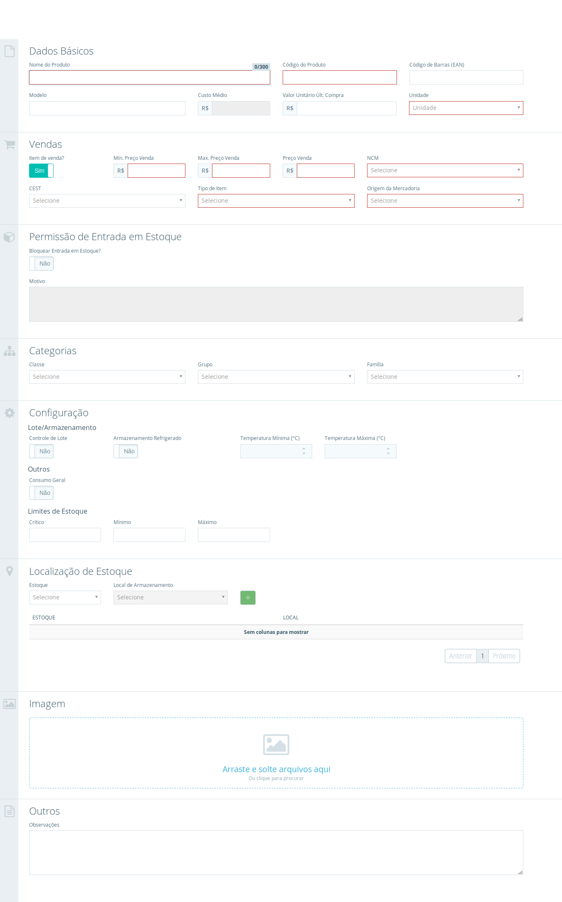

**Estoque Satélite**
Aqui é possivel criar de armazenagem para seus produtos através do cadastro estoque satélite apos informar o nome do estoque e os demais dados obrigatorios é possivel relacionar um ou mais setores de sua empresa para controlar consumo interno através do pedido online em locais de armazenamentos é possivel determinar a localização de dentro do estoque como em qual prateleira e corredor o mesmo se encontra.

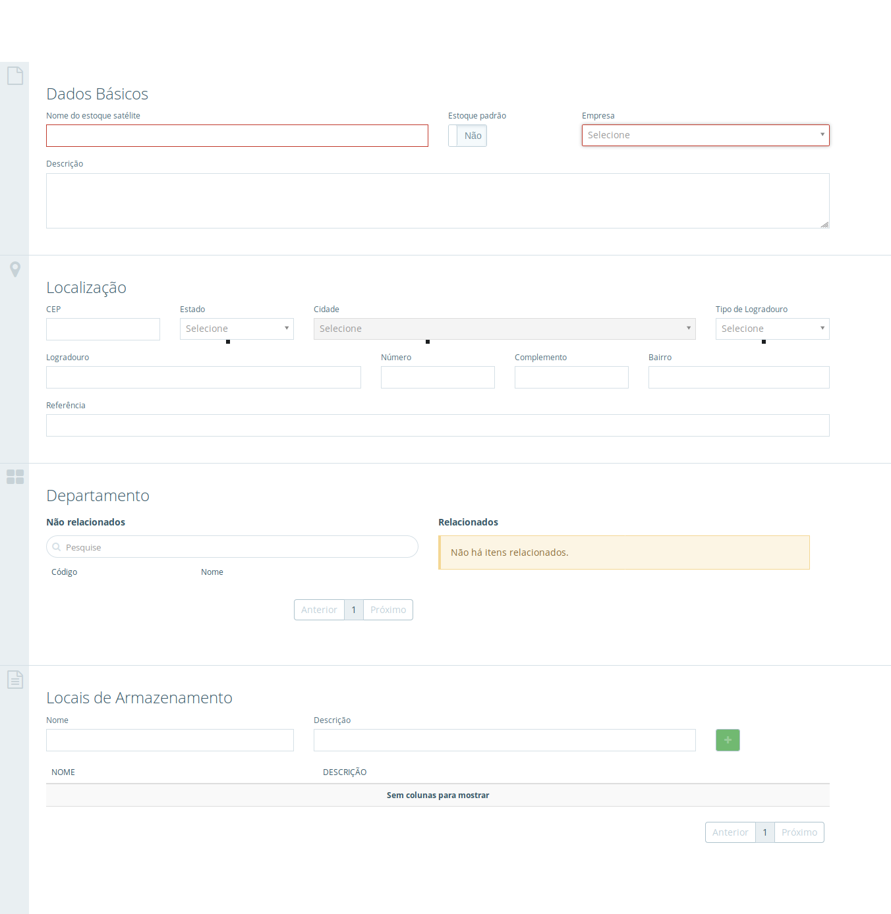

**Minhas Empresas**
Aqui vocẽ tem a informação do regime tributário de sua e suas aliquotas vigentes para calculo automático dos impostos na emissão de nota,realizar configuração para emissao de nota fistal de serviço assim como inserir os certificado digital modelo a1 para assinatura e validação da nota fistal.

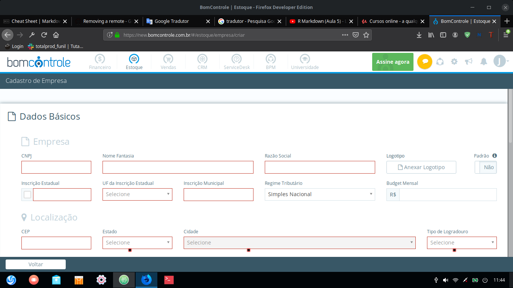

**Departamento**

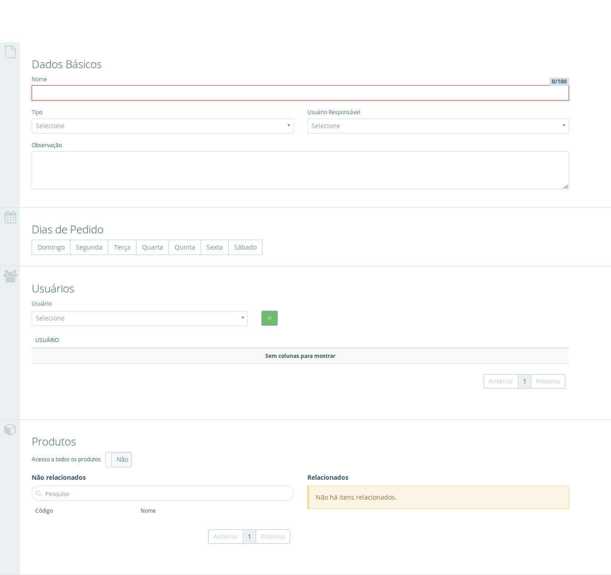

**Fornecedor**
Aqui você cadastra todos os seus fornecedores podendo ser pesssoa fisica ou juridicas insira as informações necessárias e click em salvar em visualizar lista o sistema te traz os cadastros ja inseridos no sistema aonde é possivel editar,excluir,bloqueiar ou desbloqueiar algum cadastro.

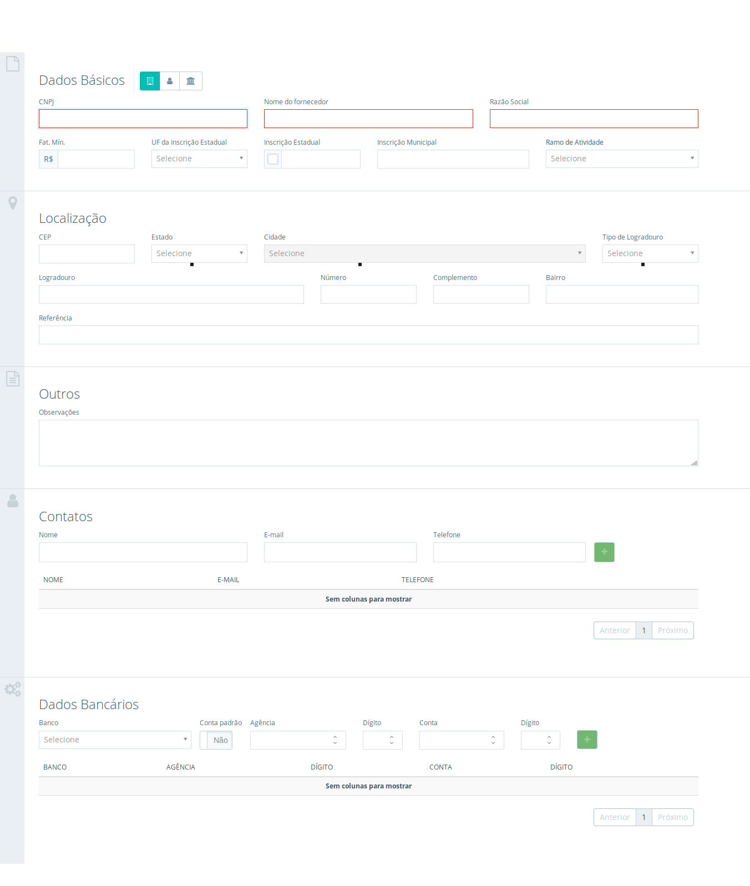

**Classe de Produto**
Aqui podemos cadastra classes para os produto utilizados pela empresa em suas operações como por exemplo classes de produtos chamados
consumíveis que ira agrupar materiais como alimentos,materiais de limpeza e higiene pessoal etc preencha os dados e click em salvar em visualizar lista o sistema te traz os cadastro ja inseridos no sistema aonde é possivel editar,excluir,bloqueiar ou desbloqueiar algum cadastro.

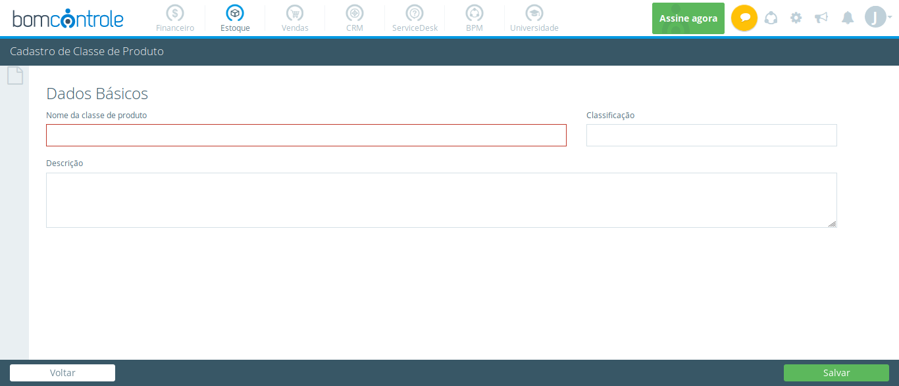

**Grupo de Produto**
Aqui podemos relacionar os produto de uma mesma familia para facil localização no sistema como por exemplo grupo de material de escritório que relaciona itens como lapis,caneta,caderno entre outros visualizar lista o sistema te traz os cadastro ja inseridos no sistema aonde é possivel editar,excluir,bloqueiar ou desbloqueiar algum cadastro.

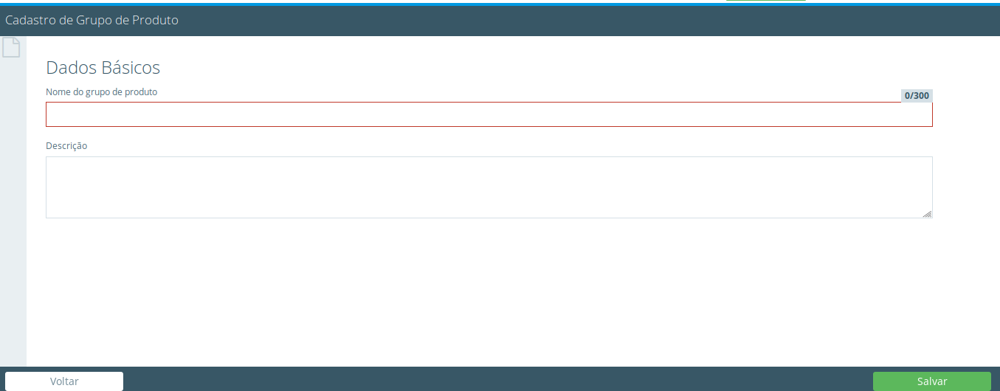

**Família de Produto**
