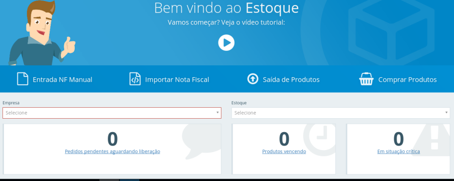
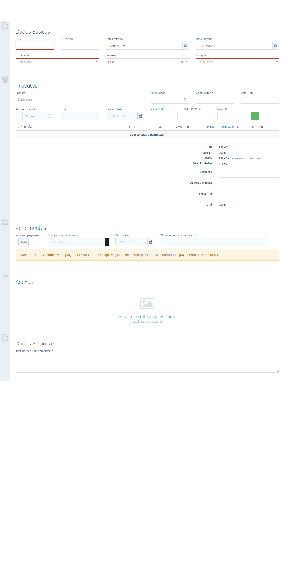
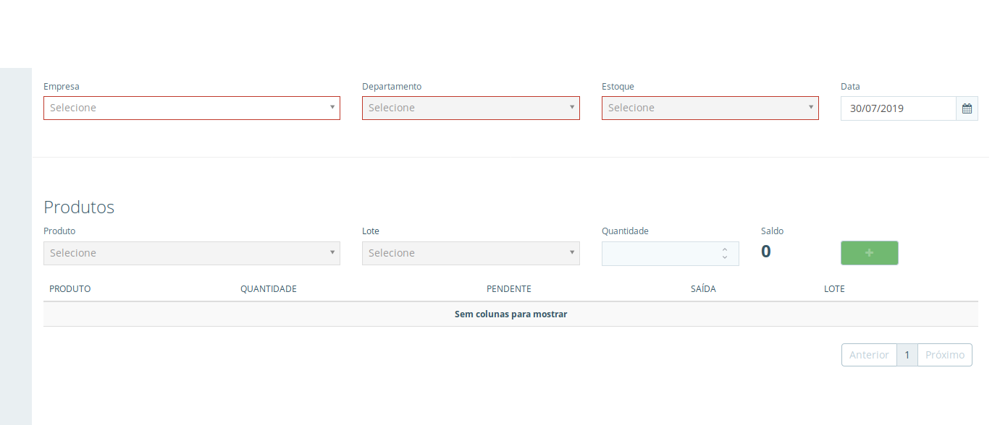
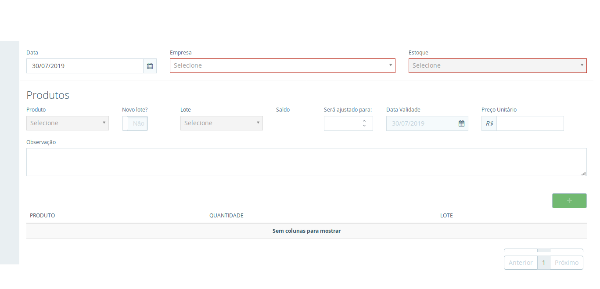
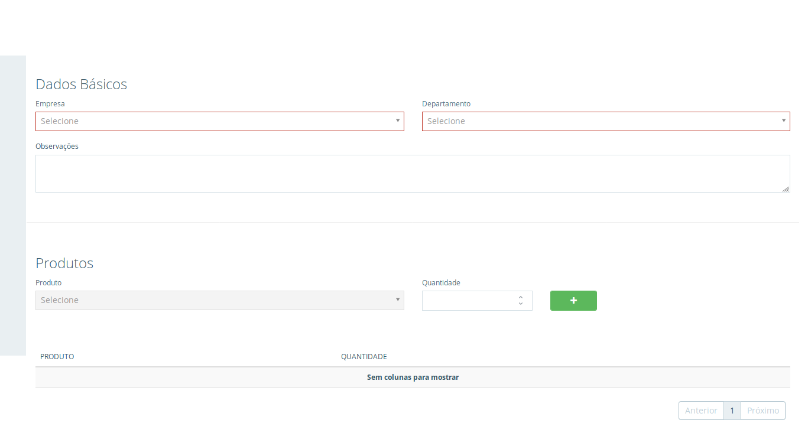
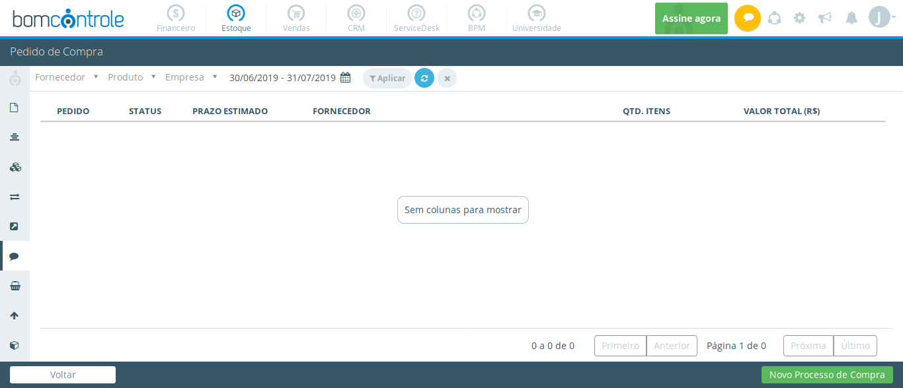

[Voltar ao Inicio](../../)

### Estoque
É uma área muito importante pois é através dele que será capaz de prever o quanto que será necessário comprar no próximo pedido ao fornecedor.
O controle de estoque de uma empresa grande ou pequena, serve para a empresa avaliar a entrada e saída de mercadorias e auxilia uma companhia a reduzir custos e administrar a cadeia de produção e distribuição com mais eficiência.

## Dia a Dia
**Dashboard**
Aqui você tem a gestão completa de seu estoque é possivel visualizar os pedidos que aguarda liberação produtos vencidados ou em situaçao critica de estoque podemos conferir graficos como movimentação de estoque e tambem checar seus pedido de comprar temos atalhos para dar entrada nas notas fiscais de seus fornecedores realizar entrada dessas mesmas notas de forma automatizada através da importação de seu XML realizar a baixa de estoque e abrir processos de comprar para cotação de produtos no menu estoque é possivel constar suas movimentações realizar tranferencias entre estoque e convidar usuarios para poder realizar pedidos interno tambem podemos cadastra produtos fornecedores,departamento entre outros .  

**Entrada de Produto**
Em entrada de produto é possivel dar
entrada de suas notas de serviço manual ou automatica para realizar processo de forma manual insira os dados basicos selecione os produtos informe os valores e seus respectivos impostos e vencimentos é possivel inserir um anexo e um comentario sobre este lançamento podemos apartir desse lançamento criar um rascunho para finalizar o preenchimento posteriormente podemos tambem importar o arquivo XML da nota enviada pelo fornecedor para preenchimento automático de suas notas.

**Saida de Estoque**
Aqui vocẽ podera realizar baixas no estoque apartir de pedidos interno criados para registrar as solicitações de materiais dos departamento de sua empresa assim como realizar baixas manuais de materiais do estoque sem precisar de um pedidos interno para isso primeiramente é exibido total de pedidos interno que estao pendentes de baixa logo abaixo são listados todos os pedidos internos pendentes podemos realizar a baixa manual para baixar diretamente do estoque ou rapidamente selecionalos apartir da opção saída para proceguir com a baixa do material e a seguir são listados os produtos que compõem o pedido interno.

**Ajuste de Estoque**
Em Ajuste de Estoque você podera corrigir o saldos dos produtos de sua empresa de acordo com contagem fisicas realizada nos locais onde estão armazenadas informe a empresa o estoque e os produto caso o produto seja controlado por lote informe se o ajuste será realizado em um lote novo ou em um ja existente insira a quantidade correta do produto informe o preço unitário e uma observação caso necessário, click em salvar é possivel cancelar este ajuste clicando em visualizar e cancelar ajuste.

**Transferência de Estoque**
Para empresas com mais de um estoque temos a funcionalidade de Transferência de estoque em tempo real ja é possivel acompanhar o seu saldo atual do iten em relação estoque de origem e criar uma listagem de itens á transferir ao salvar o processo os estoques ja são automaticamente atualizados podendo consultar los caso necessário.

**Pedido Interno**
É possivel incluir solicitações de materiais pasa uso nos setores de sua empresa selecione o departamento e click em começar é possivel alterar a empresa e o departamento insira uma observação indique os produtos e a quantidade que deseja solicitar e click em adicionar apos inserir os produtos click em salvar.

**Pedido de Compra**
Aqui podemos visualizar todos os pedidos realizados podemos realizar filtros para uma rapida localização dos pedidos além de poder tambem criar um novo processo você será redirecionado a página onde é possivel realizar um novo processo de comprar clicando em editar podemos visualizar as informações do pedido e tambem imprimi-lo.

