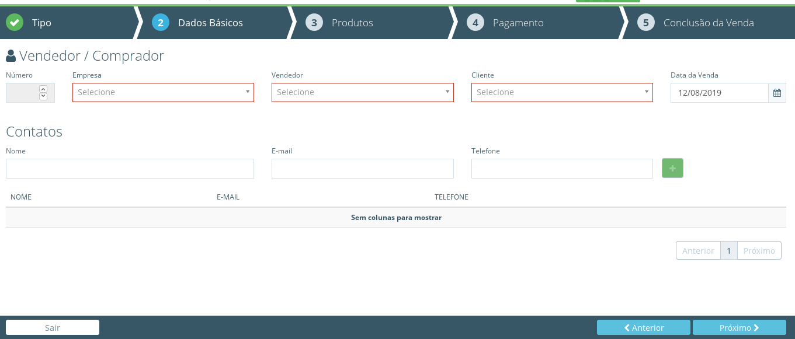
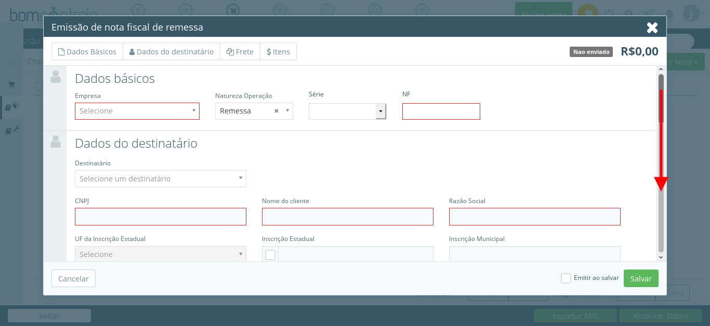
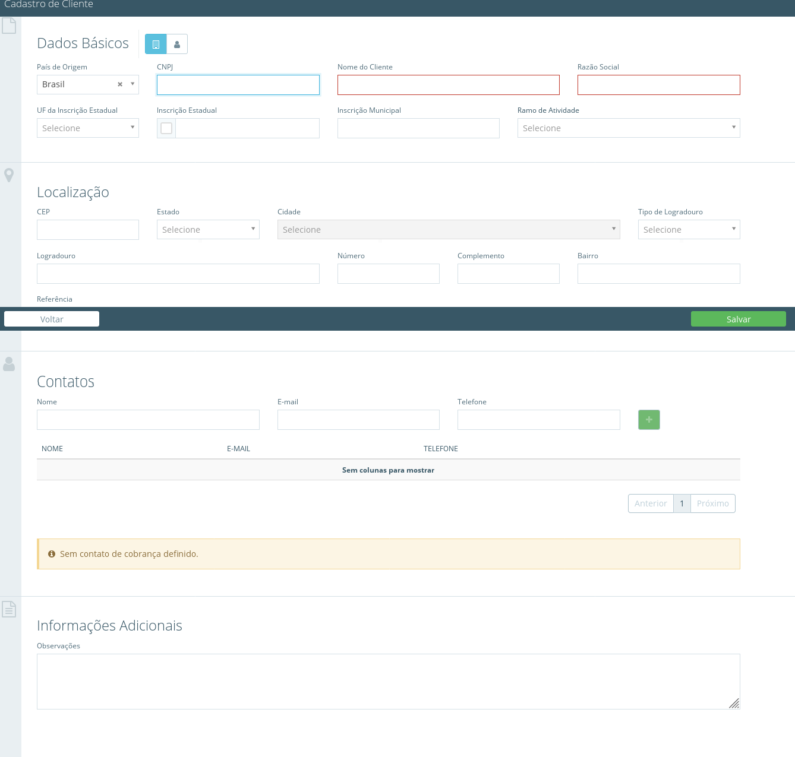
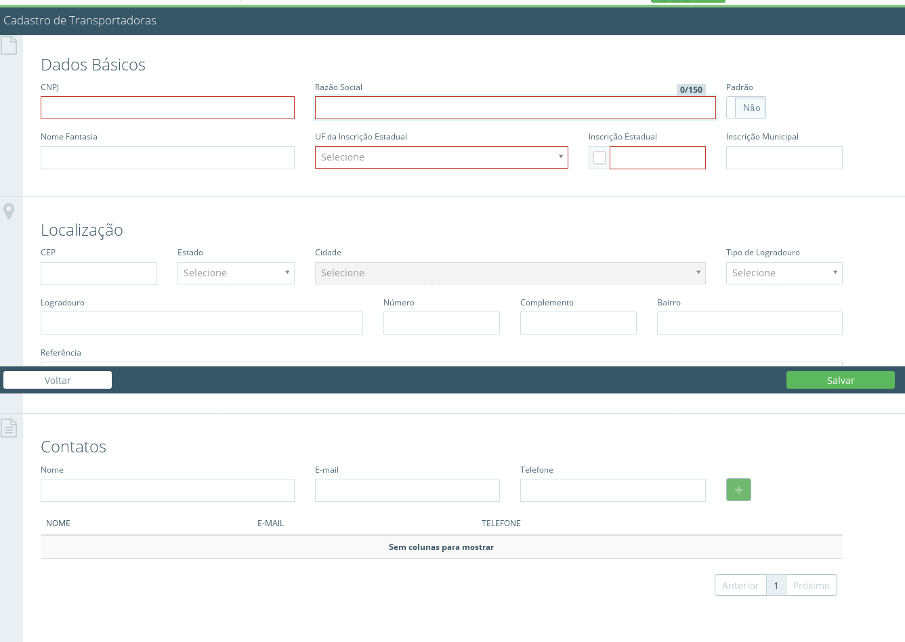

[Voltar ao Inicio](../../)

 ### Vendas
 É um guia com todos os passos que orientam a sua equipe de vendas a desempenhar suas atividades com mais facilidade e otimizar o seu tempo.
 Um processo comercial bem estruturado pode fazer milagres na produtividade e na eficiência dos seus vendedores.

## Dia a Dia
 **Dashboard**

 É a apresentação visual das informações mais importantes e necessárias para alcançar um ou mais objetivos do negócio, consolidadas e ajustadas em uma única tela para que a informação possa ser monitorada de forma ágil.

 **OrçamentoVendas**
 

 **Nota Fiscal de Produto**
 

 Aqui poderá emitir nova Nota sendo elas de remessa, retorno e devolução exportar em XML

 **Nota Fiscal de Serviço**

## Cadastro
 **Produto**

Aqui você cadastra todos os produtos que irão compor o seu estoque definindo as categorias para facilitar a sua localização, edite as configurações do produto você pode definir se o produto aceita ou não entrada sem a necessidade de um pedido de compra e tambem definir os limites para que o sistema te avise quando um produto chegar a um limite critico para que seja feita a sua reposição indique uma localização para o produto é possivel tambem adicionar uma imagem ao este produto facilitando assim sua identificação clique em salvar para finalizar o cadastro.

 **Cliente**
 

 **Vendedor**
 Aqui no sistema permite a você registrar todos os vendedores do seu time para que cada um deles possa criar e gerenciar oportunidades de vendas no modulo CRM assim você pode monitorar o progresso de cada integrante acompanhando os seus resultados além de traçar metas mensais para cada integrante da equipe.     

 **Transportadora**
 

 ## Visões
  **Relatório**
