[Voltar ao Inicio](../README.md)

###  Financeiro
O departamento financeiro da empresa é encarregado de administrar os recursos da organização para que ela possa garantir lucros a curto e longo prazo é controlando a tesouraria, os investimentos e os riscos.

## Dia a Dia
**Dashboard**
É a apresentação visual das informações mais importantes e necessárias para alcançar um ou mais objetivos do negócio, consolidadas e ajustadas em uma única tela para que a informação possa ser monitorada de forma ágil.

**Movimentação**
Vale destacar que a movimentação Financeira  e umas das telas mais acessadas do sistema podemos lançar pagamentos,recebimentos e outras tantas funções que fazem partes do nosso dia-a-dia.

**Faturamento**
Esse é o objetivo de uma das funcionalidades do App,através da função de controlar as atividades financeiras do seu negócio de maneira integrada entre os departamentos.

**Inadimplência**
O controle à inadimplência é um processo essencial para manter as finanças da empresa em ordem, e a régua de cobrança é uma ferramenta ideal para organizar a tarefa e torná-la mais efetiva.
Sendo assim, o processo se torna mais objetivo e eficiente, como qualquer outro pagamento para a empresa.

**Conciliação**
Uma conciliação consiste em se fazer a comparação física entre o saldo das contas bancárias com o controle financeiro interno de uma empresa.

**Contratos**
Aqui podemos visualizar seus Contratos realizando pagamentos de parcelas em aberto , atualizando fluxo de caixa e saldo bancárias de suas contas primeiro selecionamos um Cliente ou fornecedor para visualizar seus Contratos ou podemos visualizar todos de uma única vez.

**Aprovação Financeira**
Aqui você poderá rapidamente emitir boletos e gerar notas fiscais de seus clientes começando a partir da visualização de todas as movimentações pendentes podemos filtrar por um cliente especifico.

**Envio Remessa**

**Retorno Remessa**

**Histórico de Movimentação**
Aqui você tem acesso a todo Histórico de Movimentações financeiras podendo localizar uma movimentação que tenha sido expluída por engano, você pode realizar filtros por usuários ou tipo de ações, tambem e possivel realizar uma pesquisa por data e durante um determinado periodo pode tambem pesquisar pela descrição da movimentação e possível exportar essas informações em formato XLS localizando a movimentação é possível saber quais foram as ultimas ações realizada nela.

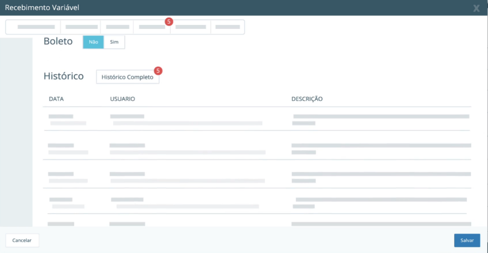

**Previsão Orçamentária**
Aqui você melhora apuração financeira gerando uma Previsão orçamentária informando o ano base e definindo índice de resultados das categorias de suas despesas, já e possível acompanhar os resultados de sua empresa onde os itens que excedem metas são destacados para sua tomada de decisão
os itens em questão são apresentados baseados num índice informando sobre o total de lançamento destas categorias no financeiro.

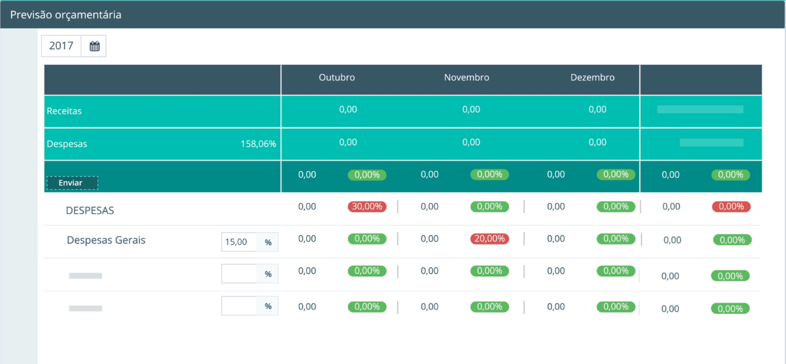

## Cadastro
**Serviço**

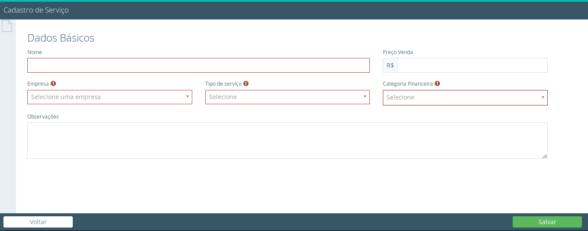

**Cadastro de Tipo de Serviço**

**Minhas empresas**

**Fornecedor**
Aqui você cadastra todos seus fornecedores podendo ser pessoas física  ou jurídicas insira informações necessárias e clica em salvar em visualizar lista ele te traz os cadastros já inseridos no sistema aonde e possível editar, excluir e bloquear ou desbloquear algum cadastro.

**Cliente**
Aqui você cadastra todo o plano das contas financeiras para controle das obrigações a pagar e a resceber da empresa, click em adicionar para criar uma nova categoria .

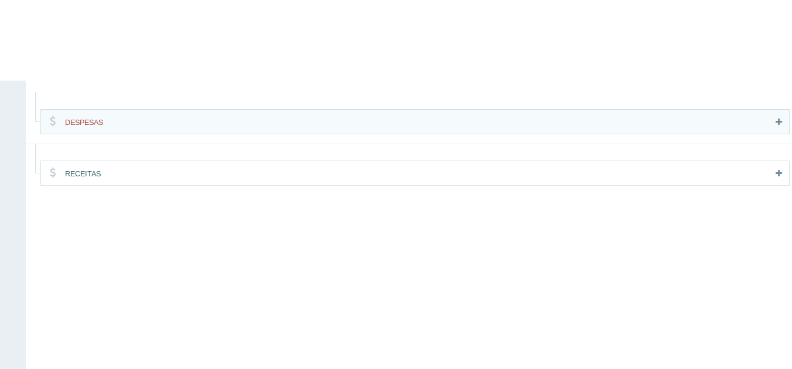

**Contas Bancárias**
Aqui vc cadastra as contas financeiras de sua empresa pode parametrizar as contas e definir se esta é a conta padrão de sua empresa ou se permite pagamentos,recebimentos ou transferências .

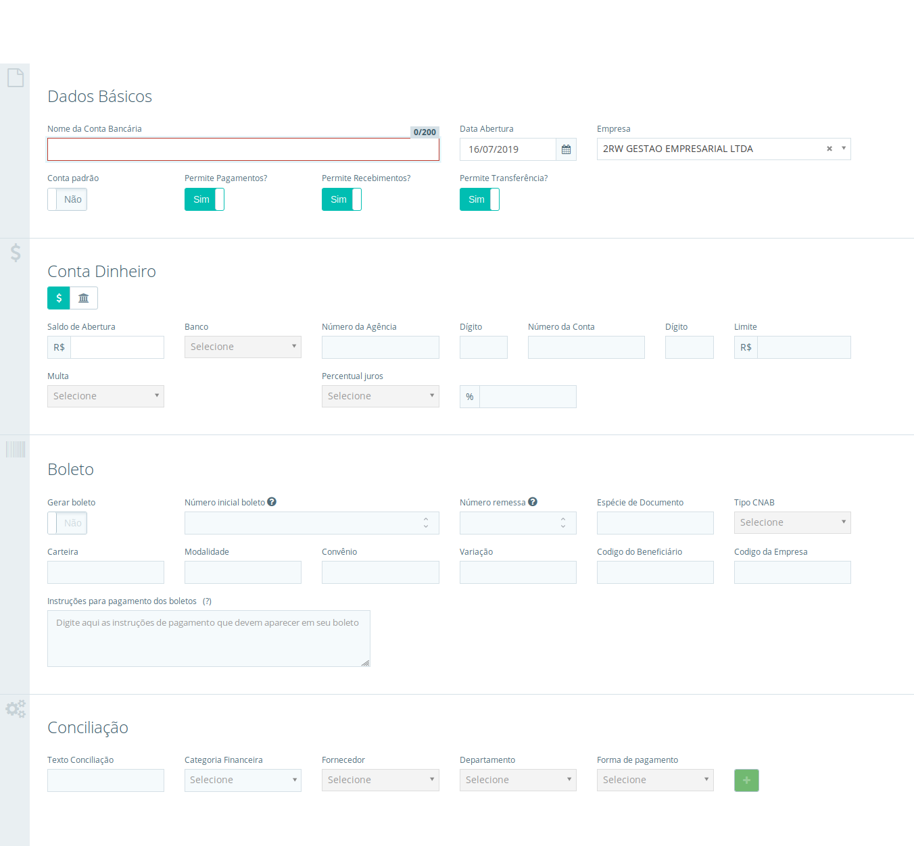

**Departamento**

**Categoria Financeira**

**Funcionário**
Aqui você cadastra todos os seus colaboradores para ter melhor controle dos gastos e facilitar seus pagamento, atenção não é possível excluir um funcionário caso ele esteja vinculado a um pagamento.

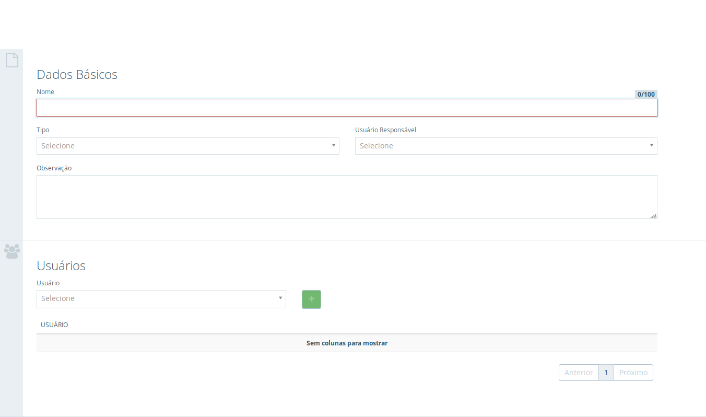

**Ramo de Atividede**

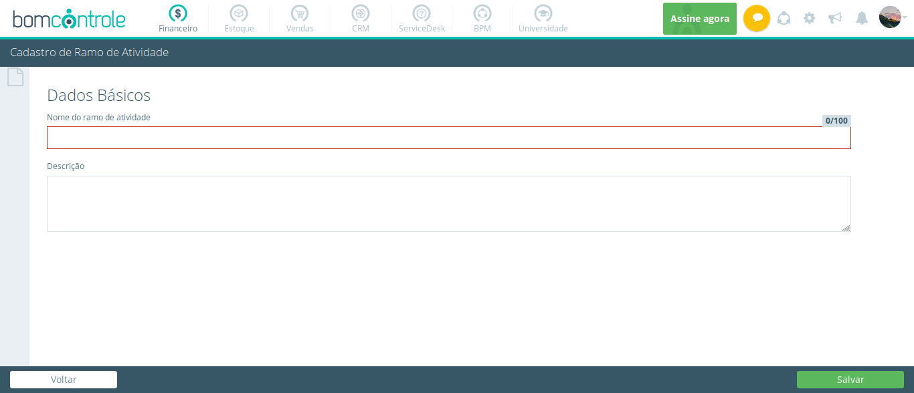

## Visões
**Fluxo de Caixa**
Em Fluxo de caixa você tem controle em suas receitas e despesas podendo visualizar por período como anual que traz todas as receitas e despesas geradas de cada mês durante todo ano ou mensal para ter um controle de cada dia dentro de um determinado mês ao lado vocẽ pode selecionar o ano base que deseja visualizar assim também como selecionar uma conta para visualizar seu fluxo .

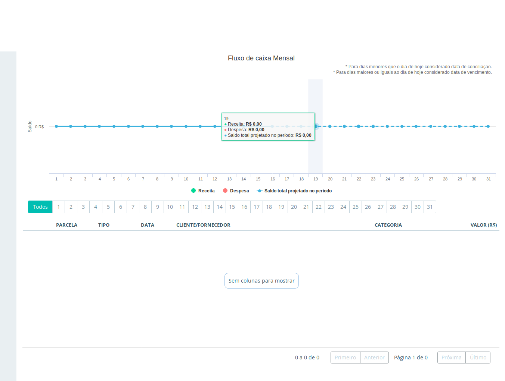

**DRE**

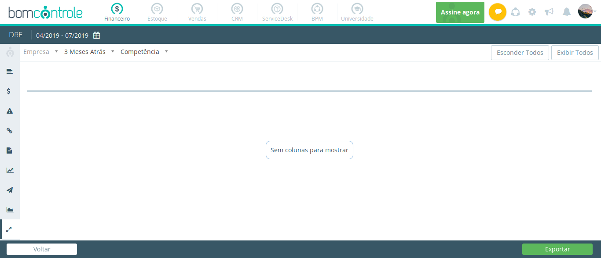

**Relatório**

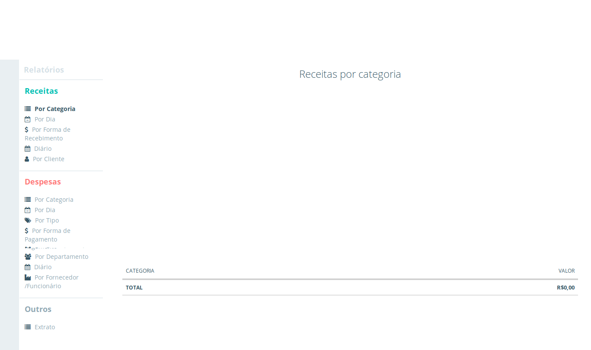

**Relatório Avançado**

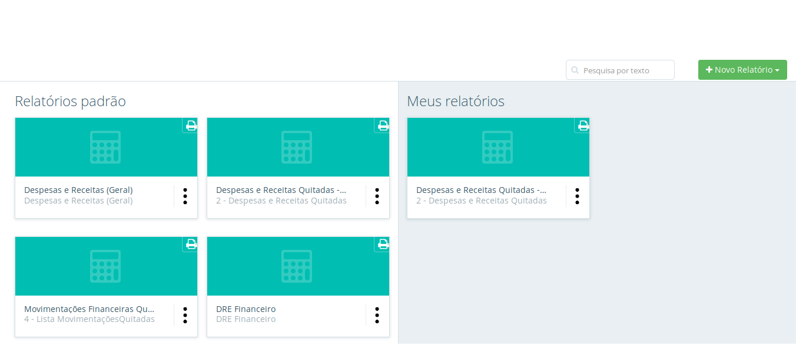

*TESTE*
