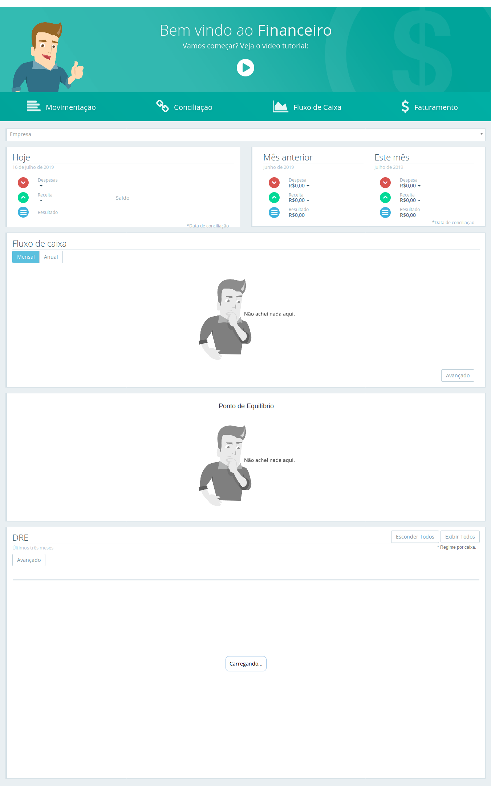
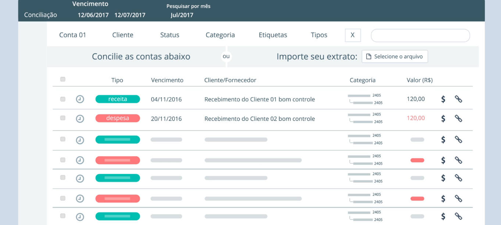

 ###  Financeiro
 O departamento financeiro da empresa é encarregado de administrar os recursos da organização para que ela possa garantir lucros a curto e longo prazo é controlando a tesouraria, os investimentos e os riscos.

## Dia a Dia
**Dashboard**
É a apresentação visual das informações mais importantes e necessárias para alcançar um ou mais objetivos do negócio, consolidadas e ajustadas em uma única tela para que a informação possa ser monitorada de forma ágil.

**Movimentação**
Vale destacar que a movimentação Financeira  e umas das telas mais acessadas do sistema podemos lançar pagamentos,recebimentos e outras tantas funções que fazem partes do nosso dia-a-dia.

**Faturamento**
Esse é o objetivo de uma das funcionalidades do App,através da função de controlar as atividades financeiras do seu negócio de maneira integrada entre os departamentos.

**Inadimplência**
O controle à inadimplência é um processo essencial para manter as finanças da empresa em ordem, e a régua de cobrança é uma ferramenta ideal para organizar a tarefa e torná-la mais efetiva.
Sendo assim, o processo se torna mais objetivo e eficiente, como qualquer outro pagamento para a empresa.

**Conciliação**
Uma conciliação consiste em se fazer a comparação física entre o saldo das contas bancárias com o controle financeiro interno de uma empresa.

**Contratos**
Aqui podemos visualizar seus Contratos realizando pagamentos de parcelas em aberto , atualizando fluxo de caixa e saldo bancárias de suas contas primeiro selecionamos um Cliente ou fornecedor para visualizar seus Contratos ou podemos visualizar todos de uma unica vez.

**Aprovação Financeira**
Aqui voce podera rapidamente emitir boletos e gerar notas fiscais de seus clientes começando apartir da visualização de todas as movimentações pendentes podemos filtrar por um cliente especifico.

**
